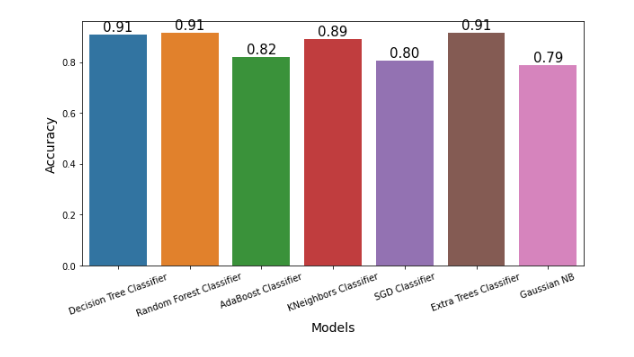

# Detección de URL maliciosas mediante modelos de aprendizaje automático

## Contexto
Las URL maliciosas o sitios web maliciosos representan una grave amenaza para la ciberseguridad. Albergan contenido no solicitado (spam, phishing, descargas no autorizadas, etc.) y atraen a usuarios desprevenidos a ser víctimas de estafas (pérdidas económicas, robo de información privada e instalación de malware), causando pérdidas de miles de millones de dólares cada año. Hemos recopilado este conjunto de datos para incluir un gran número de ejemplos de URL maliciosas, con el fin de desarrollar un modelo basado en aprendizaje automático que las identifique y nos permita detenerlas antes de que infecten sistemas informáticos o se propaguen por internet.

## Contenido
Hemos recopilado un enorme conjunto de datos de 651 191 URL, de las cuales 428 103 son benignas o seguras, 96 457 son desfiguradas, 94 111 son de phishing y 32 520 son de malware. La Figura 2 muestra su distribución porcentual. Como sabemos, una de las tareas más cruciales es la selección del conjunto de datos para un proyecto de aprendizaje automático. Hemos seleccionado este conjunto de datos de cinco fuentes diferentes.

Para recopilar URL benignas, de phishing, malware y desfiguración, utilizamos el conjunto de datos de URL (ISCX-URL-2016). Para aumentar las URL de phishing y malware, utilizamos el conjunto de datos de la lista negra de dominios de malware. Aumentamos las URL benignas utilizando el repositorio Git de Faizan. Finalmente, aumentamos el número de URL de phishing utilizando los conjuntos de datos Phishtank y PhishStorm. Como ya hemos mencionado, estos conjuntos de datos se recopilan de diferentes fuentes. Primero, recopilamos las URL de diferentes fuentes en un marco de datos independiente y, finalmente, las fusionamos para conservar únicamente las URL y su tipo de clase.

El propósito de este proyecto es entrenar y comparar diversos modelos de Machine Learning para predecir si una URL es maliciosa, basándose en características estructurales extraídas de la misma. El dataset fue obtenido de Kaggle (Malicious and Benign URL Dataset, 2020).

## Limpieza y transformación de datos

Los siguientes pasos de preprocesamiento fueron aplicados:

1.  Normalización de URLs

Eliminación del prefijo www., considerado como subdominio.

2. Mapeo de categorías

Conversión de etiquetas de texto a valores numéricos (benign = 0, defacement = 1, phishing = 2, malware = 3).

3. Ingeniería de características

Longitud de la URL.

Conteo de caracteres especiales (@, ?, -, =, ., //, etc.).

Verificación de formatos anómalos (inconsistencias entre hostname y subdominio).

Presencia del protocolo seguro HTTPS.

Conteo de dígitos y letras.

Detección de servicios de acortadores de URLs (p. ej. bit.ly, tinyurl, ow.ly).

Detección de direcciones IP incrustadas en la URL.

4. Manejo de valores faltantes

Se descartaron o corrigieron entradas inválidas en la extracción de dominios.

## Modelos entrenados

Se entrenaron y evaluaron los siguientes algoritmos de Machine Learning:

### Árbol de Decisión
Construye una estructura jerárquica en forma de árbol donde cada nodo representa una decisión basada en características. Es interpretable, aunque puede sobreajustar los datos (Quinlan, 1986).

### Random Forest
Método de ensamble basado en múltiples árboles de decisión, combinados mediante votación. Reduce el sobreajuste y mejora la precisión (Breiman, 2001).

### AdaBoost
Algoritmo de boosting que combina clasificadores débiles, ajustando los pesos de los ejemplos mal clasificados en cada iteración (Freund & Schapire, 1997).

### K-Nearest Neighbors (KNN)
Clasificador basado en distancia: asigna una clase según las etiquetas de los k vecinos más cercanos (Cover & Hart, 1967).

### Stochastic Gradient Descent (SGD) Classifier
Clasificador lineal entrenado con descenso de gradiente estocástico. Escalable y eficiente en datos de gran tamaño y dispersos.

### Extra Trees (Extremely Randomized Trees)
Variante de Random Forest que introduce mayor aleatoriedad en los puntos de división, mejorando velocidad y reduciendo varianza (Geurts et al., 2006).

### Naive Bayes Gaussiano
Clasificador probabilístico basado en el teorema de Bayes. Asume independencia entre variables y distribución gaussiana de características continuas (Zhang, 2004).

## Conclusiones

### Tamaño y diversidad
El dataset contiene 651.191 URLs, recopiladas de cinco fuentes distintas, incluyendo ISCX-URL-2016, Phishtank, PhishStorm, listas negras de malware y repositorios de URLs benignas. Esta diversidad garantiza que los modelos entrenados sobre él puedan generalizar mejor a diferentes tipos de amenazas.

### Distribución de clases

Benignas: 428.103 (~65,7%)

Desfiguración: 96.457 (~14,8%)

Phishing: 94.111 (~14,4%)

Malware: 32.520 (~5%)

Se evidencia un desbalance importante, con predominio de URLs benignas y una proporción reducida de malware, lo que sugiere la necesidad de técnicas de balanceo para entrenar modelos robustos.

### Preparación del dataset
Cada tipo de URL se recopiló por separado y luego se fusionó en un marco de datos final, conservando solo la URL y su clase. Esto facilita un procesamiento limpio y reproducible.

### Aplicabilidad para aprendizaje automático

Las etiquetas claras permiten entrenar modelos supervisados multiclase.

La combinación de fuentes especializadas para phishing y malware asegura que las clases minoritarias sean relevantes y realistas.

Se entrenaron y evaluaron distintos modelos de clasificación.  

| Modelo                   | Descripción breve                                                  | Exactitud |
|---------------------------|-------------------------------------------------------------------|-----------|
| Decision Tree Classifier  | Árbol de decisión que divide los datos en función de reglas lógicas | 0.909     |
| Random Forest Classifier  | Ensamble de múltiples árboles de decisión con votación mayoritaria  | **0.915** |
| AdaBoost Classifier       | Boosting que combina clasificadores débiles para mejorar el rendimiento | 0.820     |
| KNeighbors Classifier     | Clasificación basada en la cercanía con los vecinos más próximos   | 0.890     |
| SGD Classifier            | Modelo lineal optimizado con descenso de gradiente estocástico     | 0.805     |
| Extra Trees Classifier    | Ensamble de árboles extremadamente aleatorios                     | 0.915     |
| Gaussian NB               | Clasificador probabilístico basado en la distribución normal       | 0.790     |

  

# Bibliografía

ISCX. (2016). ISCX URL Dataset 2016. Canadian Institute for Cybersecurity. Recuperado de https://www.unb.ca/cic/datasets/url-2016.html

Phishtank. (s.f.). Phishing URL Dataset. OpenPhish. Recuperado de https://www.phishtank.com/

PhishStorm. (s.f.). PhishStorm Dataset. Recuperado de https://www.phishstorm.com/

Malware Blacklist. (s.f.). Malware Domain List. Recuperado de https://www.malwaredomainlist.com/

Faizan, M. (s.f.). Repositorio de URLs benignas. GitHub. Recuperado de https://github.com/faizan-url-repo

Breiman, L. (2001). Random forests. Machine Learning, 45(1), 5–32. https://doi.org/10.1023/A:1010933404324

Cover, T., & Hart, P. (1967). Nearest neighbor pattern classification. IEEE Transactions on Information Theory, 13(1), 21–27. https://doi.org/10.1109/TIT.1967.1053964

Freund, Y., & Schapire, R. E. (1997). A decision-theoretic generalization of on-line learning and an application to boosting. Journal of Computer and System Sciences, 55(1), 119–139. https://doi.org/10.1006/jcss.1997.1504

Geurts, P., Ernst, D., & Wehenkel, L. (2006). Extremely randomized trees. Machine Learning, 63, 3–42. https://doi.org/10.1007/s10994-006-6226-1

Kaggle. (2020). Malicious and Benign URL Dataset. Recuperado de https://www.kaggle.com/datasets/sid321axn/malicious-urls-dataset

Quinlan, J. R. (1986). Induction of decision trees. Machine Learning, 1(1), 81–106. https://doi.org/10.1007/BF00116251

Zhang, H. (2004). The optimality of Naive Bayes. En Proceedings of the Seventeenth International Florida Artificial Intelligence Research Society Conference (pp. 562–567). AAAI Press.